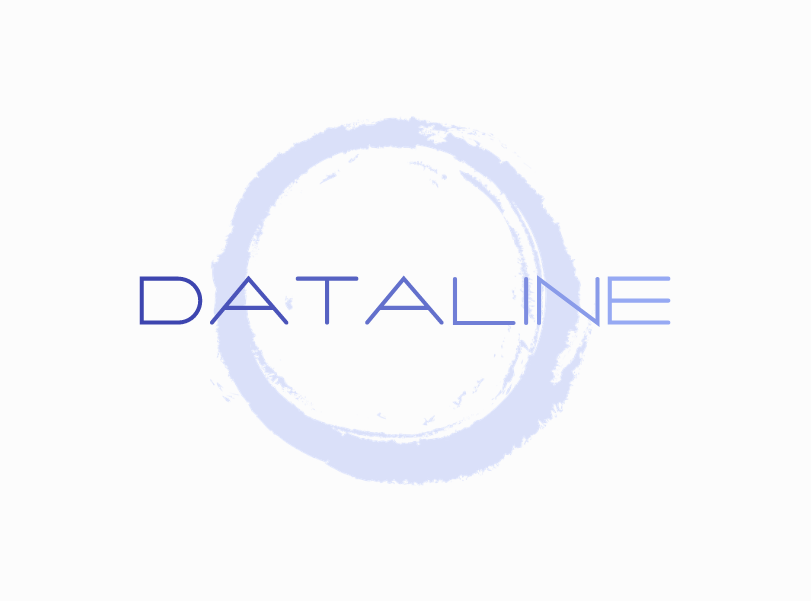

# DATALINE   

>
>   A free and open relational database with quick access to content
>

## Features 

Dataline's important set of features:

- Simple: Concise and straight-forward query language you can easily handle;

- Quick: One of the fastest data retrieving mechanism are implemented in this project;

## Query language guide

> Guide will be soon... :)

## Project description

&#160;&#160;&#160;&#160;Dataline is an open sourse database project for free collecting of your information, manipulating and its absolutely correct retrieving.

### Classes:

- Console

- QueryLanguage

- Database

- Parser

--- 

### Project structure:

- CMakeList.txt
- Directories:
    - [doc/](doc)
    - [src/](src)
    - [build/](build)
    - [lib/](lib)
    - [test/](test)

--- 
